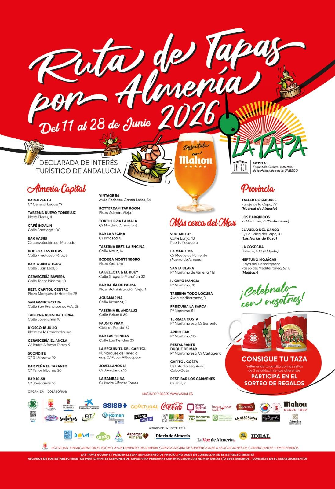

<div align="center">


[](https://github.com/Rozkipz/Mmmap/actions/workflows/ci.yml)
[](LICENSE)

**Browse every restaurant in the MICHELIN Guide — offline, on an interactive map.**

[Download APK](https://github.com/Rozkipz/Mmmap/releases/latest) · [Report a bug](https://github.com/Rozkipz/Mmmap/issues) · [Request a feature](https://github.com/Rozkipz/Mmmap/issues)

</div>

---

> **This branch (`almeriaruta2026`) adds a special mode for the [Ruta de Tapas Almería 2026](#ruta-de-tapas-almería-2026).**
> [Download the APK →](https://github.com/Rozkipz/Mmmap/releases/tag/almeriaruta2026)

---

## Features

- **Offline-first** — dataset synced on first launch and cached locally; works without internet after the initial sync, no sign-in required
- **Filter** by award (★★★ / ★★ / ★ / Bib Gourmand / Selected), cuisine, and price tier
- **Been here** — mark restaurants you've visited; pins glow gold on the map
- **Near Me** — 50 nearest restaurants sorted by distance from your location
- **Rich detail** — phone number, website, and facilities from the MICHELIN dataset
- **Deep links** directly to each restaurant's MICHELIN Guide page
- **Automatic updates** — dataset syncs in the background every 24 hours

## Screenshots

<div align="center">

<video src="https://github.com/user-attachments/assets/cfb2f2bb-4c68-4f7d-93e2-bfdca037e7bf" autoplay loop muted playsinline width="360"></video>

| Map | Filters | Detail | Near Me |
|-----|---------|--------|---------|
|  |  |  |  |

</div>

## Install

### Download (sideload)
1. Download `Mmmap_$version.apk` from the [latest release](https://github.com/Rozkipz/Mmmap/releases/latest)
2. On your phone: **Settings → Security → Install unknown apps** → allow your browser
3. Open the downloaded APK and tap **Install**

### Build from source
See [Development setup](#development-setup) below.

---

## Development setup

### Requirements

| Tool | Version |
|------|---------|
| Android Studio | Meerkat (2024.3.1) or newer |
| JDK | 17 |
| Android device/emulator | API 26 (Android 8.0) or higher |
| [`just`](https://github.com/casey/just) | any recent |

Install `just`:
```bash
cargo install just   # or: brew install just
```

Set `JAVA_HOME` to JDK 17 if it is not your system default:
```bash
export JAVA_HOME=/path/to/jdk-17
```

### Common commands

```bash
just build          # compile debug APK
just install        # install to connected device/emulator
just run            # install + launch
just test           # unit tests
just coverage       # unit tests + JaCoCo coverage report
just lint           # Android lint
just check          # lint + tests (run before committing)
```

---

## Contributing

Contributions are welcome. Please:

1. Open an issue first for anything beyond a small fix
2. Fork the repo and create a feature branch
3. Keep commits focused — one logical change per commit
4. Run `just check` before pushing; CI enforces lint and 75% coverage on new code
5. Open a pull request against `main`

There are no CLA or sign-off requirements.

---

## Tech stack

| Layer | Library |
|-------|---------|
| UI | Jetpack Compose + Material 3 |
| Map | MapLibre Native Android |
| Database | Room (SQLite) |
| Networking | Retrofit + OkHttp |
| DI | Hilt |
| Background sync | WorkManager |

All dependencies are either Apache 2.0, MIT, or LGPL-licensed — fully F-Droid-compatible.

---

## Roadmap

- [x] Visited list — browse everywhere you've been, sorted by visit date
- [x] Visited filters — "Visited only" / "Unvisited only" chip in the filters sheet
- [x] Import / export visited data — JSON backup
- [x] F-Droid distribution (metadata ready, submission pending)
- [ ] Country selector to narrow the dataset
- [ ] Offline tile bundles for full offline use

---

## Ruta de Tapas Almería 2026

<div align="center">

</div>

The **Ruta de Tapas por Almería** is an annual tapas route running across bars and restaurants in the province of Almería, Spain. The 2026 edition runs **11–28 June 2026** and features 43 participating venues.

This branch adds a second map mode that plots all 43 stops on the map alongside the usual MICHELIN data.

### How to use it

1. Download [`Mmmap_almeriaruta2026.apk`](https://github.com/Rozkipz/Mmmap/releases/tag/almeriaruta2026) and install it
2. Open the app and tap **⋮ → Ruta de Tapas Almería 2026** to switch modes
3. Tap any pin to see the bar's name, address, description, and a link to its website
4. Mark stops as visited with the ✓ button — visited pins glow gold
5. Use the **Visited / Unvisited** filter chips to track what's left
6. Switch back to **MICHELIN** mode at any time from the same menu

### The stops

| Area | Venues |
|------|--------|
| Almería capital | Barlovento, Taberna Nuevo Torreluz, Café Indalín, Bar Habibi, Bodega Las Botas, Bar Quinto Toro, Cervecería Baviera, Rest. Capitol Centro, San Francisco 26, Taberna Nuestra Tierra, Kiosco 18 Julio, Cervecería El Ancla, Scondite, Bar Peña El Taranto, Bar 10-58, Vintage 54, Rotterdam Tap Room, Tortillería La Mala, Bar La Vecina, Taberna Rest. La Encina, Bodega Montenegro, La Bellota & El Buey, Bar Bahía de Palma, Aguamarina, Taberna El Andaluz, Fausto Vram, Bar Las Tiendas, La Esquinita del Capitol, La Bambalina |
| Más cerca del Mar | 900 Millas, La Marítima, Santa Clara, El Capo Mangia, Taberna Todo Locura, Freiduría La Barca, Terraza Costa, Árido Bar, Rest. Bar Los Cármenes |
| Provincia | Taller de Sabores (Huércal de Almería), Los Barquicos (Carboneras), El Vuelo del Ganso (El Ejido), La Cosecha (El Ejido), Neptuno Mojácar (Mojácar) |

---

## License

This project is licensed under the **MIT License** — see [`LICENSE`](LICENSE) for details.

## Attribution

| Source | Licence |
|--------|---------|
| Restaurant data: [MICHELIN Guide](https://guide.michelin.com) via [ngshiheng/michelin-my-maps](https://github.com/ngshiheng/michelin-my-maps) | MIT |
| Map tiles: [OpenStreetMap contributors](https://www.openstreetmap.org/copyright) | ODbL |
