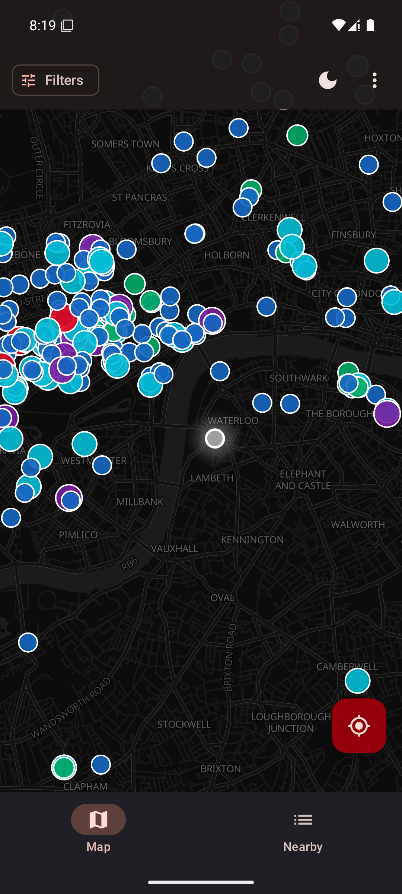
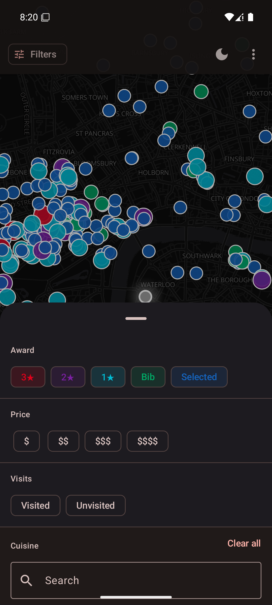
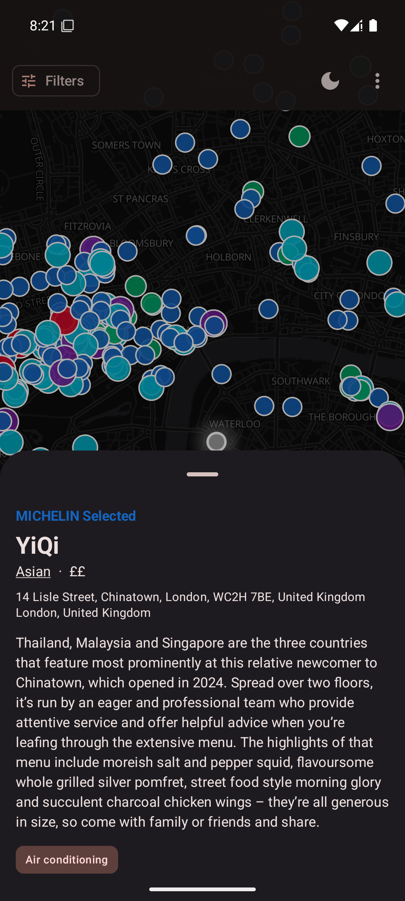
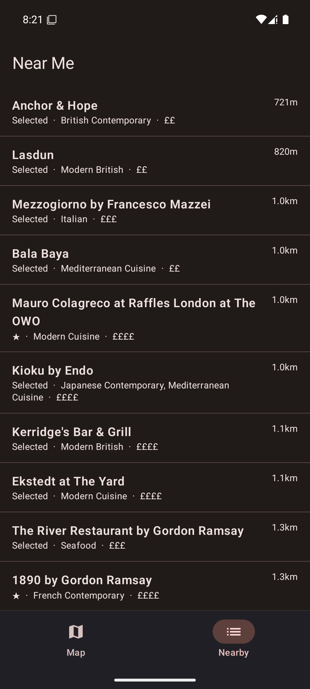

<div align="center">


[](https://github.com/Rozkipz/Mmmap/actions/workflows/ci.yml)
[](LICENSE)

**Browse every restaurant in the MICHELIN Guide — offline, on an interactive map.**

[Download APK](https://github.com/Rozkipz/Mmmap/releases/latest) · [Report a bug](https://github.com/Rozkipz/Mmmap/issues) · [Request a feature](https://github.com/Rozkipz/Mmmap/issues)

</div>

---

## Features

- **Offline-first** — dataset synced on first launch and cached locally; works without internet after the initial sync, no sign-in required
- **Filter** by award (★★★ / ★★ / ★ / Bib Gourmand / Selected), cuisine, and price tier
- **Been here** — mark restaurants you've visited; pins glow gold on the map
- **Near Me** — 50 nearest restaurants sorted by distance from your location
- **Rich detail** — photos and opening hours via Foursquare; phone number and website from the MICHELIN dataset
- **Deep links** directly to each restaurant's MICHELIN Guide page
- **Automatic updates** — dataset syncs in the background every 24 hours

## Screenshots

<div align="center">

<video src="docs/screenshots/demo.mp4" autoplay loop muted playsinline width="360"></video>

| Map | Filters | Detail | Near Me |
|-----|---------|--------|---------|
|  |  |  |  |

</div>

## Install

### Download (sideload)
1. Download `Mmmap_$version.apk` from the [latest release](https://github.com/Rozkipz/Mmmap/releases/latest)
2. On your phone: **Settings → Security → Install unknown apps** → allow your browser
3. Open the downloaded APK and tap **Install**

### Build from source
See [Development setup](#development-setup) below.

---

## Development setup

### Requirements

| Tool | Version |
|------|---------|
| Android Studio | Meerkat (2024.3.1) or newer |
| JDK | 17 |
| Android device/emulator | API 26 (Android 8.0) or higher |
| [`just`](https://github.com/casey/just) | any recent |

Install `just`:
```bash
cargo install just   # or: brew install just
```

Set `JAVA_HOME` to JDK 17 if it is not your system default:
```bash
export JAVA_HOME=/path/to/jdk-17
```

### API keys

Create `local.properties` (gitignored — never commit this):
```
fsq.api.key=YOUR_FOURSQUARE_API_KEY
```

Get a free key at [developer.foursquare.com](https://developer.foursquare.com/).
Place enrichment (photos, hours, phone) is disabled but the map works without a key.

### Common commands

```bash
just build          # compile debug APK
just install        # install to connected device/emulator
just run            # install + launch
just test           # unit tests
just coverage       # unit tests + JaCoCo coverage report
just lint           # Android lint
just check          # lint + tests (run before committing)
```

---

## Contributing

Contributions are welcome. Please:

1. Open an issue first for anything beyond a small fix
2. Fork the repo and create a feature branch
3. Keep commits focused — one logical change per commit
4. Run `just check` before pushing; CI enforces lint and 75% coverage on new code
5. Open a pull request against `main`

There are no CLA or sign-off requirements.

---

## Tech stack

| Layer | Library |
|-------|---------|
| UI | Jetpack Compose + Material 3 |
| Map | MapLibre Native Android |
| Database | Room (SQLite) |
| Networking | Retrofit + OkHttp |
| DI | Hilt |
| Background sync | WorkManager |
| Place enrichment | Foursquare Places API |

All dependencies are either Apache 2.0, MIT, or LGPL-licensed — fully F-Droid-compatible.

---

## Roadmap

- [x] Visited list — browse everywhere you've been, sorted by visit date
- [x] Visited filters — "Visited only" / "Unvisited only" chip in the filters sheet
- [x] Import / export visited data — JSON backup
- [x] F-Droid distribution (metadata ready, submission pending)
- [ ] Country selector to narrow the dataset
- [ ] Offline tile bundles for full offline use
- [ ] IzzyOnDroid distribution

---

## License

This project is licensed under the **MIT License** — see [`LICENSE`](LICENSE) for details.

## Attribution

| Source | Licence |
|--------|---------|
| Restaurant data: [MICHELIN Guide](https://guide.michelin.com) via [ngshiheng/michelin-my-maps](https://github.com/ngshiheng/michelin-my-maps) | MIT |
| Place enrichment: [Foursquare Places API](https://developer.foursquare.com/) | Foursquare ToS |
| Map tiles: [OpenStreetMap contributors](https://www.openstreetmap.org/copyright) | ODbL |
